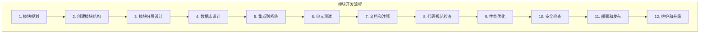
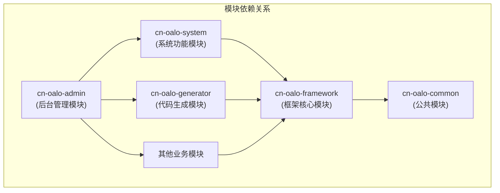
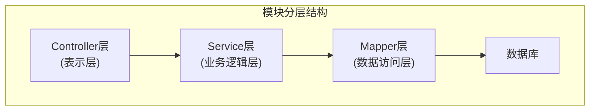
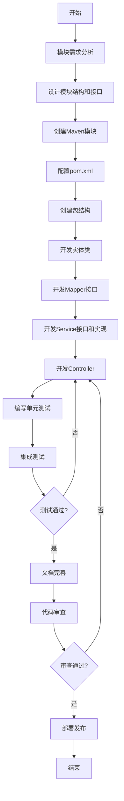
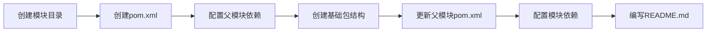
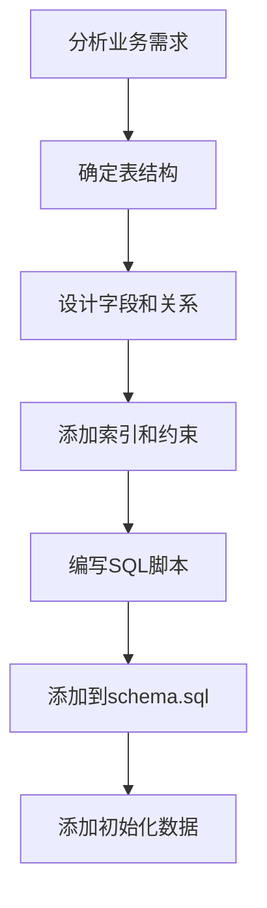
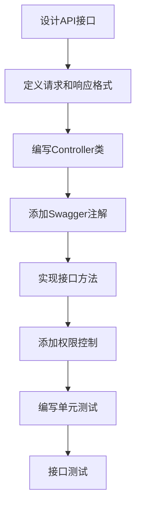
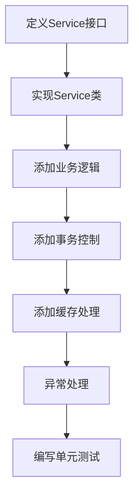

# 模块开发流程图

## 1. 整体开发流程

```mermaid
graph TB
    subgraph "模块开发流程"
        A[1. 模块规划] --> B[2. 创建模块结构]
        B --> C[3. 模块分层设计]
        C --> D[4. 数据库设计]
        D --> E[5. 集成到系统]
        E --> F[6. 单元测试]
        F --> G[7. 文档和注释]
        G --> H[8. 代码规范检查]
        H --> I[9. 性能优化]
        I --> J[10. 安全检查]
        J --> K[11. 部署和发布]
        K --> L[12. 维护和升级]
    end
```

## 2. 模块依赖关系

```mermaid
graph TB
    subgraph "模块依赖关系"
        M["cn-oalo-admin<br/>(后台管理模块)"] --> N["cn-oalo-system<br/>(系统功能模块)"]
        M --> O["cn-oalo-generator<br/>(代码生成模块)"]
        M --> P["其他业务模块"]
        N --> Q["cn-oalo-framework<br/>(框架核心模块)"]
        O --> Q
        P --> Q
        Q --> R["cn-oalo-common<br/>(公共模块)"]
    end
```

## 3. 模块分层结构

```mermaid
graph TB
    subgraph "模块分层结构"
        S["Controller层<br/>(表示层)"] --> T["Service层<br/>(业务逻辑层)"]
        T --> U["Mapper层<br/>(数据访问层)"]
        U --> V["数据库"]
    end
```

## 4. 详细开发流程

```mermaid
flowchart TD
    A[开始] --> B[模块需求分析]
    B --> C[设计模块结构和接口]
    C --> D[创建Maven模块]
    D --> E[配置pom.xml]
    E --> F[创建包结构]
    F --> G[开发实体类]
    G --> H[开发Mapper接口]
    H --> I[开发Service接口和实现]
    I --> J[开发Controller]
    J --> K[编写单元测试]
    K --> L[集成测试]
    L --> M{测试通过?}
    M -->|否| J
    M -->|是| N[文档完善]
    N --> O[代码审查]
    O --> P{审查通过?}
    P -->|否| J
    P -->|是| Q[部署发布]
    Q --> R[结束]
```

## 5. 模块创建流程

```mermaid
flowchart LR
    A[创建模块目录] --> B[创建pom.xml]
    B --> C[配置父模块依赖]
    C --> D[创建基础包结构]
    D --> E[更新父模块pom.xml]
    E --> F[配置模块依赖]
    F --> G[编写README.md]
```

## 6. 数据库设计流程

```mermaid
flowchart TD
    A[分析业务需求] --> B[确定表结构]
    B --> C[设计字段和关系]
    C --> D[添加索引和约束]
    D --> E[编写SQL脚本]
    E --> F[添加到schema.sql]
    F --> G[添加初始化数据]
```

## 7. 接口开发流程

```mermaid
flowchart TD
    A[设计API接口] --> B[定义请求和响应格式]
    B --> C[编写Controller类]
    C --> D[添加Swagger注解]
    D --> E[实现接口方法]
    E --> F[添加权限控制]
    F --> G[编写单元测试]
    G --> H[接口测试]
```

## 8. 服务层开发流程

```mermaid
flowchart TD
    A[定义Service接口] --> B[实现Service类]
    B --> C[添加业务逻辑]
    C --> D[添加事务控制]
    D --> E[添加缓存处理]
    E --> F[异常处理]
    F --> G[编写单元测试]
``` 